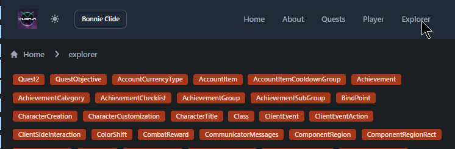
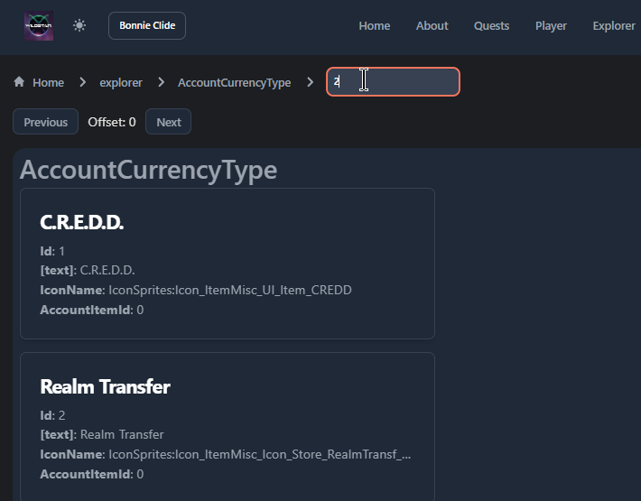

# AdminUI

Admin UI for accessing a NexusForever server, if it has the api code
installed.  Runs only on localhost and accesses the server api
through http://localhost:5003

External links:

* https://www.jabbithole.com/

## Quick Start

Make sure the WorldServer is running, this version created and
working with commit XXX in my repository:

    https://github.com/JasonGoemaat/NexusForever/tree/AddApi

Install dependencies in this repo:

    pnpm i

Start in dev mode and open in browser:

    pnpm dev --open

Click 'Explore' in the header to get a list of GameTables that
can be explored:

Click on a table to get a list of the first 100 entries
and an input at the top to enter an ID to lookup:

